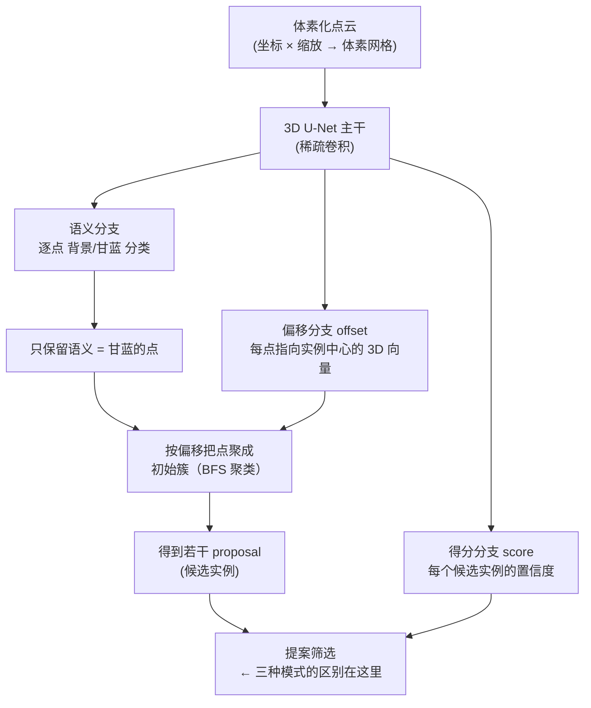

# PointGroup 实例分割方法说明

## 一、PointGroup 是什么

PointGroup 是 CVPR 2020 提出的**自底向上的三维实例分割**方法，在本研究中作为检测式对比方法。其核心是一个 3D U-Net 主干，输出**三个并行的预测分支**：



三个分支各司其职：

- **语义分支**：判断每个点是"甘蓝"还是"背景"，先把甘蓝点分离出来。
- **偏移分支**：预测每个点指向它所属植株中心的向量，把散乱的点变成往中心聚拢的点。
- **得分分支**：给每个候选实例（proposal）打一个置信度分数，用于后续筛选去重。

## 二、Top-Down / NMS / IACH 是什么

这三个名字指的是 PointGroup 拿到一堆候选 proposal 之后，**如何从中挑出最终实例**的三种不同策略，也就是 `proposal_selection` 的三种取值。它们是论文表格中三种 PointGroup 模式的来源。

### 1. PointGroup (NMS) —— 原始做法

步骤：

1. 用**得分阈值**筛掉低分 proposal；
2. 用**最小点数阈值**筛掉碎屑；
3. 关键一步：**NMS（非极大值抑制）按 IoU 去重**——把互相重叠过多的 proposal（实际指向同一株）按分数从高到低，重叠 IoU 超过阈值者丢弃。

> 本质是"分数高者优先、重叠就淘汰"，是 PointGroup 论文的默认策略。

### 2. PointGroup (Top-Down) —— 自顶向下贪心

做法：

- 分数从高到低排序；
- 高分的 proposal **先独占它覆盖的点**；
- 低分 proposal 只能去竞争**剩余尚未被占的点**，若自己覆盖的点超过 50% 已被抢走，则放弃。

> 与 NMS 的区别：NMS 是"重叠就整体丢弃"，Top-Down 是"高分先占点、低分争剩余"，能保留更多点、减少漏分。

### 3. PointGroup (IACH) —— 更轻量的偏移聚类

做法：

1. 直接用**偏移向量把点移向实例中心**；
2. 在移位后的点上跑 **DBSCAN**（邻域半径 0.05 m、最小点数 100）聚成簇。

> 本质是"只靠偏移 + DBSCAN"，不需要 proposal 打分，更轻量。这也是 IACH 基线 F1 在三模式中相对较稳的原因。

## 三、三种模式对比

| 模式 | 核心机制 | 依赖的分支 |
|------|:---:|:---:|
| PointGroup (NMS) | 得分阈值 + **IoU NMS 去重** | 语义 + 偏移 + **得分** |
| PointGroup (Top-Down) | 分数排序 + **高分先占点** | 语义 + 偏移 + **得分** |
| PointGroup (IACH) | **偏移移位 + DBSCAN** | 语义 + 偏移（**不用得分**） |

## 四、与论文表格的关系

表格中的「局部聚类」（meanshift / hdbscan / watershed_3d）是在上述三种模式**拿到 proposal 之后**，对**未被 proposal 覆盖的剩余点**进行的二次聚类，再接入 GIDM 后处理。完整链条为：

```
语义分割 → PointGroup 提案 (Top-Down / NMS / IACH 三选一)
        → 剩余点局部聚类 (meanshift / hdbscan / watershed_3d)
        → GIDM（PCA 骨架切割 + 碎片回并）
```
